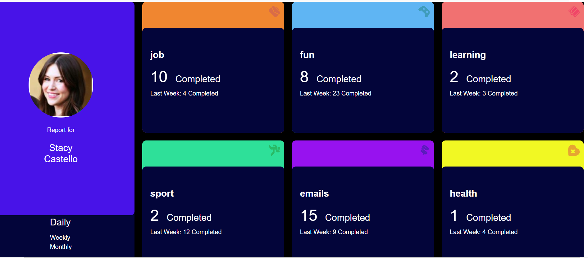
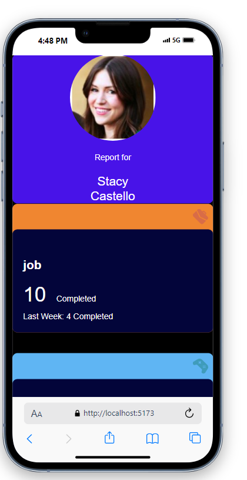

# miladfm-frontend-solution

This template provides a streamlined setup for building a React application with TypeScript and Vite, leveraging Hot Module Replacement (HMR) and curated ESLint rules. It showcases the development of a personal ticket-tracking dashboard.

## Technologies

* Frontend: React, TypeScript
* Build Tool: Vite
* Styling: SCSS

## Project Overview

This project establishes a personal ticket-tracking dashboard application, utilizing React and TypeScript for the core functionality. SCSS is employed for styling, and Vite manages the build process.

## Folder Structure

```
miladfm-frontend-solution
├── node_modules
├── public
├── src
│   ├── assets
│   │   ├── images
│   │   └── styles
│   │       ├── partials
│   │       │   └── _variables.scss
│   │       └── main.scss
│   ├── components
│   │   ├── BoxComponent
│   │   │   ├── Box.component.tsx
│   │   ├── ProfileComponent
│   │   │   ├── Profile.component.tsx
│   │   └── WrapperComponent
│   │       ├── Wrapper.component.tsx
│   ├── utils
│   │   ├── colorObject.ts
│   │   └── timeframes.ts
│   ├── App.tsx
│   ├── index.scss
│   ├── main.tsx
│   └── vite-env.d.ts
├── .eslintrc.cjs
├── .gitignore
├── index.html
├── package.json
├── pnpm-lock.yaml (or yarn.lock)
├── README.md (This file)
├── tsconfig.app.json
├── tsconfig.json
└── tsconfig.node.json
```
Objective
The challenge in this project is to retrieve data housed within timeframes.ts and render it in a way that aligns with the provided design assets. These design assets encompass both mobile and desktop versions (located in the /design folder, not included in this repository).

Expected Behavior
Responsive Design: The application layout adapts seamlessly to various screen sizes, optimizing the user experience across devices.
Hover States: Interactive elements on the page should exhibit hover effects, providing visual cues for user interaction.
Timeframe Switching: Users have the ability to toggle between Daily, Weekly, and Monthly timeframe views.
Dynamic Text: The timeframe text for the preceding period dynamically updates based on the currently selected view (e.g., "Yesterday - 2hrs" for Daily).

Styling
The project leverages SCSS files to manage styling for different device orientations. These SCSS files reside within the src/assets/styles directory:

main.scss: General styles applicable across all layouts
_variables.scss: SCSS variables for consistent styling
large.scss: Tailored styles for large screens
medium.scss: Styles optimized for medium screens (tablets)
small.scss: Styles designed for small screens (mobile devices)

Getting Started
Clone the Repository:
```
git clone https://github.com/Alamin-Juma/challenges
```

Navigate to the Project Directory:
```cd miladfm-frontend-solution
```
Install Dependencies:
```pnpm install (or npm  install)
```

Start the Development Server:
```
pnpm run dev (or npm run dev)
```

This command will launch the development server and open the application in your default web browser.

Development Notes
Most Challenging Aspect
The most demanding aspect of the project involved ensuring the responsiveness of the design meticulously matches the provided design assets, particularly when considering multiple screen sizes and the interactive behavior of elements.

Easiest Aspect
Setting up the initial React project using Vite was a straightforward process due to the well-structured documentation and comprehensive tooling support offered by Vite.

Additional Considerations
This project deliberately avoids the use of external UI component libraries or utility libraries (e.g., Tailwind CSS, Lodash). This approach aims to showcase the project's reliance on pure CSS and JavaScript/TypeScript for optimal control and customization.

Screenshots
PC or Laptop View



Mobile View



.gitignore
The .gitignore file plays a vital role in version control by specifying files and folders that should be excluded from source code management. To ignore a certain folder, add the folder name to the .gitignore file. For example, to ignore the node_modules folder, add the following line:


node_modules/
To ignore multiple folders, add each folder name on a new line:
node_modules/
dist/
